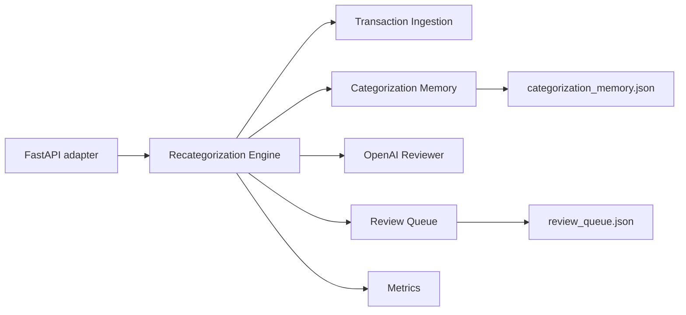

# AI Bookkeeping App

CSV-first, multi-user AI bookkeeping MVP for improving transaction
categorization with trusted historical decisions and selective OpenAI review.

The project is being developed iteratively. The backend already supports CSV
parsing, OpenAI-assisted recategorization, and file-backed categorization
memory. The next implementation milestone connects those pieces into a
memory-first Recategorization Engine.

Project guidance:

- [Development lifecycle](docs/development-lifecycle.md)
- [Bookkeeping categorization language](CONTEXT.md)
- [Phase 1 domain contracts](docs/domain-contracts.md)
- [Canonical phased specification](https://github.com/liuwei7923/AIBookKeeping/issues/11)
- [Phase 1 implementation issue](https://github.com/liuwei7923/AIBookKeeping/issues/15)
- [Repository agent guidance](AGENTS.md)

## Product Goal

The product is built around one learning loop:

1. Import trusted historical categorizations.
2. Store each distinct transaction as categorization memory.
3. Reuse strong historical evidence for future transactions.
4. Ask OpenAI only when deterministic evidence is insufficient.
5. Let the user review uncertain results and corrections.
6. Promote explicit user decisions back into trusted memory.

This is a retrieval and review system, not a fine-tuning project.

## Correctness First

A false categorization is more harmful than an unknown categorization. The
application therefore optimizes categorization precision before coverage:

- assign a category only when evidence passes a conservative threshold
- prefer an unknown categorization over a weakly supported guess
- avoid OpenAI when trusted memory already provides a strong answer
- mark every AI-generated suggestion as needing review
- never treat an AI suggestion as trusted until the user confirms it
- preserve the evidence and reason behind each categorization decision

The core domain terms are:

| Term | Meaning |
| --- | --- |
| Categorization Decision | The application's conclusion about a transaction category, including its evidence and certainty. |
| Unknown Categorization | A deliberate decision to withhold a category because evidence is missing, weak, or conflicting. |
| Needs Review | A decision that should be inspected and confirmed by the user. |
| Trusted Categorization | A category imported from a trusted source or explicitly confirmed by the user. |
| False Categorization | An assigned category that differs from the category the user confirms as correct. |
| Categorization Anomaly | An assigned category that conflicts with historical weekly, monthly, or quarterly patterns. |

See [CONTEXT.md](CONTEXT.md) for the canonical language.

## Current Implementation

The repository currently includes:

- FastAPI application and multipart file uploads
- deterministic CSV parsing and normalization
- OpenAI-assisted CSV recategorization
- local JSON categorization-memory storage
- categorization-memory import and inspection endpoints
- OpenAI request counting and request logging
- parser, memory, API, and live-server tests

The important current limitation is:

> `POST /transactions` still sends every parsed transaction
> directly to OpenAI. It does not yet retrieve or apply categorization memory.

Phase 1 addresses this gap.

## Target Architecture



The Recategorization Engine is the primary domain module. It will hide memory
retrieval, deterministic decision rules, AI routing, batching, confidence
assignment, and result ordering behind one batch-oriented interface.

The Review Queue is shown as part of the target architecture but is deferred to
Phase 2.

## Iterative Roadmap

### Phase 1: Memory-First Recategorization MVP

[Phase 1 issue](https://github.com/liuwei7923/AIBookKeeping/issues/15)

Focus modules:

- Recategorization Engine
- Transaction Ingestion
- Categorization Memory
- OpenAI Reviewer
- Metrics

Phase 1 will:

- normalize incoming transactions into one canonical shape
- assign request-scoped transaction IDs
- create optional fingerprints for duplicate detection
- retrieve trusted memory by normalized merchant and transaction direction
- resolve strong deterministic matches without OpenAI
- preserve conflicting history for multi-category merchants
- send only unresolved transactions to OpenAI
- include only relevant memory examples and aggregate category counts
- request structured model output keyed by transaction ID
- return an ordered batch response with decision provenance
- stop before OpenAI when the AI-review approval threshold is exceeded

Phase 1 configurable defaults:

| Setting | Default | Purpose |
| --- | ---: | --- |
| Merchant consensus threshold | 2 distinct transactions | Minimum unanimous evidence for a merchant-level local decision |
| Memory candidates per AI transaction | 5 | Maximum detailed examples sent to OpenAI |
| AI transactions per request | 25 | Maximum unresolved transactions in one model request |
| AI-review approval threshold | 50 | More than this number pauses before any OpenAI request |

Deterministic decisions require the same normalized merchant and direction.
An exact normalized-statement match is the strongest evidence. Merchant-level
consensus requires the configured number of distinct transactions to agree on
one category.

Weak, missing, or conflicting evidence remains an Unknown Categorization.
OpenAI may suggest a known category or propose a new category, but every model
result remains Needs Review.

### Phase 2: Review Infrastructure

[Phase 2 retry issue](https://github.com/liuwei7923/AIBookKeeping/issues/14)

Focus module:

- Review Queue

Phase 2 will add:

- persistent review batches and review items
- incomplete-import tracking outside trusted memory
- batch-scoped approval for more than 50 AI-required transactions
- process-safe resumption of an approved batch
- an auditable retry flow for unresolved OpenAI work

The exact approval and retry interfaces are intentionally deferred until this
phase.

### Phase 3: Human Confirmation

[Phase 3 confirmation UI issue](https://github.com/liuwei7923/AIBookKeeping/issues/13)

Focus modules:

- Confirmation UI
- review-item resolution
- trusted-memory promotion

Phase 3 will let users:

- inspect the original transaction and suggested category
- see conflicting and supporting categorization memory
- confirm or correct individual decisions
- explicitly select items for bulk confirmation
- promote only confirmed or corrected decisions into trusted memory

A blind confirm-all action is out of scope.

### Phase 4: Quality Expansion

[Phase 4 automatic-promotion evaluation](https://github.com/liuwei7923/AIBookKeeping/issues/12)

Focus modules:

- Category Reference
- Categorization Anomaly detection
- quality metrics and audit history

Phase 4 will add:

- canonical category names, definitions, aliases, and merchant patterns
- weekly, monthly, and quarterly categorization-anomaly detection
- precision, false-categorization, override, unknown, and review-volume metrics
- evaluation of richer retrieval only when deterministic retrieval is inadequate
- evaluation of controlled automatic promotion only after accuracy is measured

Automatic promotion is not currently authorized.

## Categorization Memory

Categorization memory is the local knowledge base of Trusted Categorizations.
The current store is:

```text
data/categorization_memory.json
```

Each item represents one trusted historical decision:

```json
{
  "id": "23d81053-8281-4f31-94eb-b2bc02753ae7",
  "date": "2026-03-24",
  "merchant": "Electrify America",
  "statement": "ELECTRIFY AMERICA 65RESTON VA",
  "normalized_merchant": "electrify america",
  "amount": -7.0,
  "direction": "debit",
  "original_category": null,
  "corrected_category": "Electric Vehicle Charging",
  "source": "imported_labeled_history",
  "notes": "EV charging merchant",
  "created_at": "2026-03-24T18:00:00+00:00",
  "updated_at": "2026-03-24T18:00:00+00:00",
  "confidence": 1.0,
  "usage_count": 0,
  "last_matched_at": null
}
```

Current rules:

- imported memory must include a merchant and final category
- `original_category` is optional
- `statement` preserves the raw bank description when available
- memory import and retrieval do not call OpenAI
- AI suggestions are not added automatically

Phase 1 will add optional transaction fingerprints and duplicate-aware evidence
counting. A UUID will remain the record identity; the fingerprint will only
detect repeated imports.

## API

### `GET /health`

Returns:

```json
{"status": "ok"}
```

### `GET /admin/openai-usage`

Returns the configured model and in-process OpenAI request count. The `/admin`
prefix organizes operational routes but does not currently provide access
control.

### `POST /categorization-memory`

Imports trusted historical categorizations from a UTF-8 CSV.

Required columns:

- `merchant`
- `category` or `corrected_category`

Optional columns:

- `amount`
- `date`
- `statement` or `original statement`
- `original_category`
- `notes`

Current response:

```json
{
  "imported": 120,
  "skipped": 0
}
```

This endpoint does not call OpenAI.

Example:

```bash
curl -X POST \
  http://127.0.0.1:8000/categorization-memory \
  -F "file=@historical-transactions.csv;type=text/csv"
```

### `GET /categorization-memory`

Returns a human-readable view of stored categorization memory.

```bash
curl http://127.0.0.1:8000/categorization-memory
```

Example response:

```json
[
  {
    "date": "2026-03-24",
    "merchant": "Electrify America",
    "statement": "ELECTRIFY AMERICA 65RESTON VA",
    "amount": -7.0,
    "direction": "debit",
    "original_category": null,
    "category": "Electric Vehicle Charging",
    "notes": "EV charging merchant"
  }
]
```

### `POST /transactions`

Current behavior:

- parses the uploaded CSV
- sends every parsed transaction to OpenAI
- returns a JSON array of category suggestions

```bash
curl -X POST \
  http://127.0.0.1:8000/transactions \
  -F "file=@transactions.csv;type=text/csv"
```

Current response shape:

```json
[
  {
    "date": "2026-03-24",
    "amount": -7.0,
    "merchant": "Electrify America",
    "original_category": "Gas",
    "suggested_category": "Electric Vehicle Charging",
    "reason": "The merchant is an electric vehicle charging provider."
  }
]
```

Phase 1 intentionally changes this endpoint to a batch response after adding
memory-first deterministic decisions and bounded AI review. The target contract
is defined in the
[Phase 1 issue](https://github.com/liuwei7923/AIBookKeeping/issues/15).

The FastAPI application composes focused route modules:

```text
bookkeeping_app/routes/
  health.py
  admin.py
  categorization_memory.py
  transactions.py
```

## User Workflow

A typical workflow is:

1. Import a trusted historical CSV through `POST /categorization-memory`.
2. Inspect the stored decisions through `GET /categorization-memory`.
3. Upload a new transaction CSV through `POST /transactions`.
4. Review the returned category suggestions and reasons.

The current API does not yet persist user confirmations or promote reviewed
suggestions into trusted memory.

## Cost Control Strategy

Categorization-memory import and retrieval are deterministic and do not call
OpenAI. The current `POST /transactions` implementation sends every parsed
transaction batch to OpenAI and records the request in the in-process usage
counter.

Phase 1 will reduce external calls and token usage by:

- resolving strong trusted-memory matches before calling OpenAI
- sending only unresolved transactions for AI review
- limiting detailed memory examples and context size
- batching unresolved transactions within configured limits
- pausing before any request when the AI-review approval threshold is exceeded

## Setup

Create and activate a virtual environment:

```bash
python3 -m venv .venv
source .venv/bin/activate
```

Fish shell:

```fish
source .venv/bin/activate.fish
```

Install dependencies:

```bash
pip install -r requirements.txt
```

Create the environment file:

```bash
cp .env.example .env
```

Add an OpenAI API key:

```env
OPENAI_API_KEY=your_openai_api_key_here
```

Optional memory path override:

```env
CATEGORIZATION_MEMORY_PATH=data/categorization_memory.json
```

The checked-in development-user catalog lives at
`config/development_users.json`. Each developer keeps their selected default in
their ignored local `.env`; `.env.example` selects Wei Liu as an example. Change
`DEV_USER_ID` locally to use Jia Zhang or another development UUID. Never commit
the local `.env` file.

In development, user-owned APIs use `DEV_USER_ID` when the request omits the
temporary `X-User-Id` header, so the usual local request needs no UUID. To test
as a different user without editing `.env`, override it per request:

```bash
curl -H "X-User-Id: 0c050ed3-d41b-468c-9c29-e9e6da905c04" \
  http://127.0.0.1:8000/categorization-memory
```

The header is a development seam, not production authentication. Outside
development, requests to user-owned APIs must supply an explicit user ID until
verified authentication replaces this interface.

## Run Locally

```bash
uvicorn main:app --reload
```

The API runs at `http://127.0.0.1:8000`.

Interactive FastAPI documentation is available at:

```text
http://127.0.0.1:8000/docs
```

## Run Tests

```bash
pytest
```

Check linting and formatting locally with Ruff:

```bash
ruff check main.py bookkeeping_app scripts tests
ruff format --check main.py bookkeeping_app scripts tests
```

Direct dependencies are declared in `requirements.in`, while
`requirements.txt` locks the complete resolved dependency graph. Regenerate the
lock after changing a direct dependency:

```bash
pip-compile requirements.in
```

## Continuous Integration

GitHub Actions runs Python compilation, the full test suite, Ruff linting, and
Ruff formatting checks for every pull request and every push to `master`. The
workflow does not require an OpenAI API key. Configure the `test` and `quality`
jobs as required status checks in the repository's branch protection settings.
Dependabot checks the Python and GitHub Actions dependencies weekly.

## Generate Dummy Transactions

Generate deterministic source and canonical transactions for local manual
judgment UI development:

```bash
python -m scripts.dummy_data \
  --user-id 550e8400-e29b-41d4-a716-446655440000 \
  --count 24 \
  --seed 42 \
  --output data/dummy_transactions.json
```

The UUID user ID is required and becomes the dataset owner. Every generated
source transaction uses it, and canonical transactions inherit ownership from
their embedded source rather than duplicating the field. The same user ID,
count, and seed always produce the same JSON. Use at least eight transactions
to include every supported manual judgment state. See
[docs/dummy-transaction-data.md](docs/dummy-transaction-data.md) for the dataset
shape and scenario details.

Project verification:

```bash
python3 -m py_compile main.py bookkeeping_app/*.py tests/*.py
.venv/bin/python -m pytest -q
```

## Privacy

Transactions submitted to `POST /transactions` leave the local process and are
transmitted to OpenAI. Categorization-memory import and inspection remain
local.

The design minimizes external data by resolving strong matches locally and
sending only the relevant fields and memory examples for unresolved
transactions.

## Out of Scope

The current implementation does not yet include:

- a database
- authentication and complete multi-user account isolation
- the simple frontend planned for the MVP
- background jobs
- agent orchestration
- streaming
- fine-tuning
- general ledger, invoicing, payroll, tax filing, or autonomous accounting-system posting
